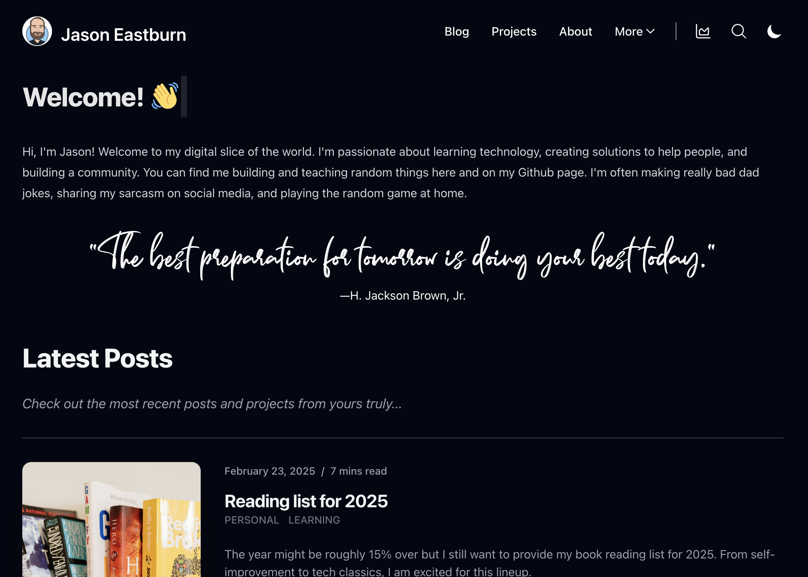

<h1 align="center">jasoneastburn.com 👨🏻‍💻</h1>

## Hello, nerds! 👋🏼
Welcome! This is where I share my journey in learning, reading, and coding. I love learning and sharing. This site documents my experiences with:

**🧠 Learning:** Exploring new concepts, acquiring skills, and embracing lifelong learning.

**📖 Reading:** Diving into books, articles, and research papers that pique my interest.

**👨‍💻 Coding:** Building projects, experimenting with new technologies, and sharing code snippets.

## What You'll Find Here 🔍

**📝 Blog Posts:** Regular articles on topics ranging from technical tutorials to reflections on books I've read and lessons I've learned.

**🛠️ Projects:** Showcases of my coding projects, including descriptions, code samples, and demos.

**🔖 Reading List:** A curated list of books and articles that have influenced my thinking and learning.

**🔗 Resources:** Links to helpful tools, websites, and communities that I find valuable.

**👤 About Me:** More information about my background, interests, and how to connect with me.

## Technologies Used 💻

* React 19+
* NextJS 15+
* Tailwind CSS 
* Markdown
* Umami Analytics
* Firebase Analytics
* Firebase Authentication
* Firebase App Hosting
* Firebase Functions

## Getting Started 🚀

1.  **Visit the Website:** [jasoneastburn.com](https://www.jasoneastburn.com) 
2.  **Browse the Blog:** Check out the latest blog posts for insights and tutorials.
3.  **Explore Projects:** Dive into my coding projects and see what I've been working on.
4.  **Connect with Me:** Feel free to reach out!

## Contributing 🤝

While this is primarily a personal website, I welcome feedback and suggestions! If you find any errors or have ideas for improvements, please feel free to:

* Open an issue on this repository.
* Submit a pull request with your changes.

---

© 2025 Jason Eastburn

